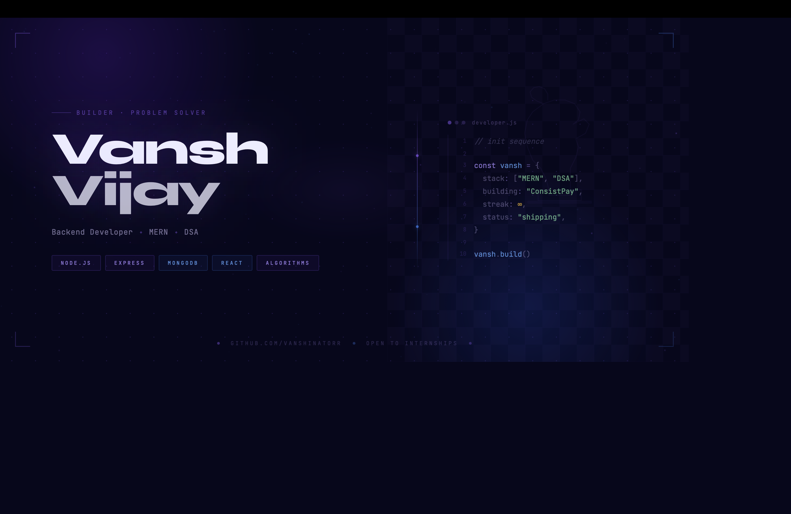

<p align="center">
  <!--  -->
  
</p>

<h1 align="center">Vansh Vijay</h1>

<p align="center">
  Backend Developer • MERN • DSA
</p>

<p align="center">
  Building systems, solving problems, staying consistent.
</p>

---

## 🚀 About Me

- 🎓 3rd Year CSE Student
- 💻 Learning Backend Development & MERN Stack
- 🧠 Solving DSA problems consistently
- 🚀 Building ConsistPay
- ♟️ Chess Player • 1500 ELO
- 📌 Open to internships & collaboration

---

## 🌐 Connect With Me

<p align="center">
  <a href="https://www.linkedin.com/in/vansh-vijay/" target="_blank">
    
  </a>

  <a href="https://www.instagram.com/vansh_vj/" target="_blank">
    
  </a>

  <a href="https://x.com/vanshvijay9" target="_blank">
    
  </a>

  <a href="https://codolio.com/profile/vanshinatorr" target="_blank">
    
  </a>
</p>

---

## 🛠️ Tech Stack

<p align="center">
  
</p>

---

## 🚀 Featured Projects

### 🔹 ConsistPay
Gamified coding consistency platform focused on streaks, accountability and long-term discipline.

### 🔹 DSA Practice
Structured DSA solutions with optimized approaches and consistency.

### 🔹 Daily Coding Habit Tracker
Consistency-focused coding tracker built to visualize progress and maintain streaks.

### 🔹 Todo App
Task management app featuring dynamic DOM manipulation and local storage support.

---

## 📊 GitHub Stats

<p align="center">
  
</p>

<p align="center">
  
</p>

<p align="center">
  
</p>

---

## 🐍 Contribution Animations

<p align="center">
  <picture>
    <source media="(prefers-color-scheme: dark)" srcset="https://raw.githubusercontent.com/vanshinatorr/vanshinatorr/output/github-snake-dark.svg" />
    <source media="(prefers-color-scheme: light)" srcset="https://raw.githubusercontent.com/vanshinatorr/vanshinatorr/output/github-snake.svg" />
    
  </picture>
</p>

<br/>

<p align="center">
  <a href="https://github.com/vanshinatorr">
    
  </a>
</p>

---
---

## ⚡ Mindset

```js
const vansh = {
  code: ["JavaScript", "TypeScript"],
  technologies: ["React", "Node.js", "MongoDB", "Express"],
  currentFocus: "Backend Development & DSA",
  building: "ConsistPay",
  mindset: "Consistency compounds.",
  playstyle: "Strategic"
};
