<div align="center">



<br/><br/>

[](https://git.io/typing-svg)

<br/><br/>

<a href="https://www.linkedin.com/in/vansh-vijay/"></a>
<a href="https://daily-coding-habit-tracker.vercel.app"></a>
<a href="https://codolio.com/profile/vanshinatorr"></a>
<a href="https://leetcode.com/u/vanshinatorr/"></a>
<a href="mailto:vanshvijay9784@gmail.com"></a>

</div>

---

```text
+-----------------------------------------------------------------------+
|  SYSTEM CONFIGURATION & STATUS                                        |
+-----------------------------------------------------------------------+
|  Node Host  : Vansh Vijay [v1.2.0-stable]                             |
|  Uptime     : B.Tech CSE (2023 - 2027) @ JECRC University, Jaipur     |
|  Status     : ACTIVE_FOR_HIRING (Open to SDE Internships / Roles)     |
|  Base ELO   : 1500+ ELO (Strategic chess thinker)                     |
|  Core Stack : Node.js | Express.js | React.js | MongoDB               |
+-----------------------------------------------------------------------+
```

```ts
// candidate_profile.ts
const candidate: Developer = {
  name: "Vansh Vijay",
  specialization: "High-Performance Backends & High-Fidelity User Interfaces",
  mentality: "Consistency beats intensity when repeated long enough.",
  achievements: {
    codolio: "Top 30 Coding Profiles at JECRC (among 2000+ students)",
    dsa: "300+ Solved problems (LeetCode & GFG in C++)",
    realWorld: "Shipped 'ConsistPay' - a live web app with 60+ active users"
  }
};
```

---

## 🚀 Featured Engineering Modules

### 📁 `module/consistpay` — Monetized Coding Accountability Platform
> **Status**: Production-Ready / Fully Deployed / Real money transactions
> **Users**: 60+ active students tracking coding consistency

- **Core Backend Architecture**: Engineered a custom **Streak Tracking Engine** in Node.js/Express, incorporating payment validation and duplicate verification algorithms to prevent falsified reports.
- **Payment Gateway Integration**: Embedded secure **Razorpay Webhooks** to manage real-time subscriptions, transaction statuses, and user database updates.
- **Gemini AI Core**: Leveraged **Google Gemini API** to analyze daily user coding activity and generate personalized analytics/insights.
- **Stack**: Node.js, Express, MongoDB, Mongoose, Razorpay SDK, Google Gemini AI.

[⚡ Visit Live Platform](https://daily-coding-habit-tracker.vercel.app) • [📄 Source Code](https://github.com/vanshinatorr/Daily-coding-habit-tracker)

---

### 📁 `module/chess-multiplayer` — Real-Time Game State Synchronizer
> **Status**: Active / Low-Latency WebSocket Room Sync

- **WebSocket Sync Engine**: Designed a WebSocket server using **Socket.IO** to manage real-time chess move synchronization and room matchmaking.
- **State Recovery**: Configured full state serialization on the backend, ensuring client-state resilience and active game timers remain synced across disconnects.
- **Stack**: WebSockets, Socket.IO, Node.js, Express, HTML5 canvas/JS.

[♟️ Play Live Game](https://chess-multiplayer-y54n.onrender.com) • [📄 Source Code](https://github.com/vanshinatorr/chess-multiplayer)

---

### 📁 `module/backend-prep` — System Design & Interview Architecture
> **Status**: Active Study & Documentation Repository

- Documenting advanced Node.js architecture (Event Loop, cluster modules, stream handling), database indexing strategies, REST API best practices, and secure JWT authentication lifecycles.

[📄 Explore Repository](https://github.com/vanshinatorr/backend-interview-prep)

---

## 📬 SDE Candidate API Reference

```http
GET /api/candidate/profile
```
#### Response Payload (`200 OK`)
```json
{
  "status": "Available",
  "target_roles": ["SDE Intern", "Full Stack Developer", "Backend Engineer"],
  "current_locations": ["Jaipur, India", "Remote"],
  "contact_email": "vanshvijay9784@gmail.com"
}
```

```http
POST /api/candidate/hire
```
#### Request Parameters
| Parameter | Type | Required | Description |
| :--- | :--- | :--- | :--- |
| `company_name` | `string` | **Yes** | Name of your company or startup |
| `role_type` | `string` | **Yes** | Full Stack, Frontend, Backend, or SDE Intern |
| `stipend_range`| `string` | **Yes** | Compensation package / monthly stipend range |

#### Example Request
```bash
curl -X POST https://github.com/vanshinatorr \
  -H "Content-Type: application/json" \
  -d '{"company_name": "Acme Corp", "role_type": "SDE Intern", "stipend_range": "Competitive"}'
```

---

## 📊 Runtime Metrics & Activity

<table width="100%" border="0" cellpadding="0" cellspacing="0">
  <tr>
    <td width="55%" align="center" valign="top" style="border: none; background: transparent;">
      
    </td>
    <td width="45%" align="center" valign="top" style="border: none; background: transparent;">
      
    </td>
  </tr>
  <tr>
    <td colspan="2" align="center" style="border: none; padding-top: 15px; background: transparent;">
      
    </td>
  </tr>
  <tr>
    <td colspan="2" align="center" style="border: none; padding-top: 15px; background: transparent;">
      <picture>
        <source media="(prefers-color-scheme: dark)" srcset="https://raw.githubusercontent.com/vanshinatorr/vanshinatorr/output/github-contribution-grid-snake-dark.svg" />
        <source media="(prefers-color-scheme: light)" srcset="https://raw.githubusercontent.com/vanshinatorr/vanshinatorr/output/github-contribution-grid-snake.svg" />
        
      </picture>
    </td>
  </tr>
</table>

---

<div align="center">
  <br/>
  <a href="https://www.linkedin.com/in/vansh-vijay/"></a>
  <a href="https://x.com/vanshvijay9"></a>
  <a href="mailto:vanshvijay9784@gmail.com"></a>
  <br/><br/>
  
</div>
