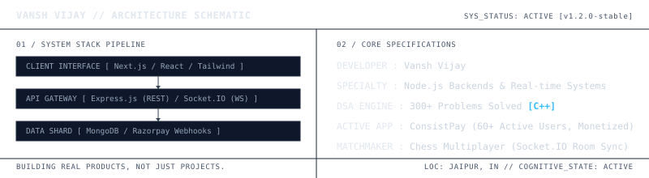
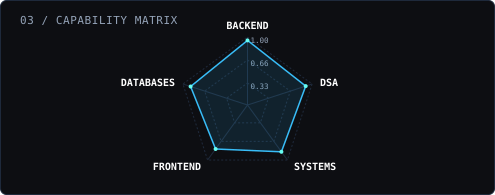

<div align="center">



<br/><br/>

[](https://git.io/typing-svg)

<br/><br/>

</div>

---

# 📂 WORKSPACE EXPLORER

> **Workspace**: `vansh-vijay-core [v1.2.0-stable]`  
> *Click on files to open and inspect candidate configurations.*

<details open>
  <summary><b>📁 system_config/</b></summary>
  <div style="padding-left: 15px; margin-top: 5px; margin-bottom: 5px;">
    <details>
      <summary>📄 <code>spec_sheet.ts</code> (Candidate Metadata)</summary>
      <div style="margin-top: 10px; border-left: 2px solid #1e293b; padding-left: 12px; margin-bottom: 10px;">

```ts
// spec_sheet.ts
const candidate: Developer = {
  name: "Vansh Vijay",
  university: "JECRC University, Jaipur — B.Tech CSE (2023–2027)",
  specialization: "High-Performance Backends & High-Fidelity UI",
  coreStack: ["Node.js", "Express.js", "React.js", "MongoDB"],
  achievements: {
    codolio: "Top 30 Coding Profiles at JECRC (among 2000+ students)",
    dsa: "300+ Solved problems (LeetCode & GFG in C++)",
    chess: "1500+ peak ELO (Strategic chess thinker)"
  }
};
```
      </div>
    </details>
  </div>
</details>

<details open>
  <summary><b>📁 featured_modules/</b></summary>
  <div style="padding-left: 15px; margin-top: 5px; margin-bottom: 5px;">
    <details>
      <summary>📄 <code>consistpay.md</code> (Streak accountability engine)</summary>
      <div style="margin-top: 10px; border-left: 2px solid #1e293b; padding-left: 12px; margin-bottom: 10px;">

### ⚡ ConsistPay — Coding Accountability Platform
> **Status**: Production-Ready / Fully Deployed / Real money transactions  
> **Users**: 60+ active students tracking coding consistency

- **Core Backend Architecture**: Engineered a custom **Streak Tracking Engine** in Node.js/Express, incorporating payment validation and duplicate verification algorithms to prevent falsified reports.
- **Payment Gateway Integration**: Embedded secure **Razorpay Webhooks** to manage real-time subscriptions, transaction statuses, and user database updates.
- **Gemini AI Core**: Leveraged **Google Gemini API** to analyze daily user coding activity and generate personalized analytics/insights.
- **System Design & Trade-offs (SDE Depth)**:
  - *Data Race Prevention*: Resolved concurrency issues with duplicate daily streak submissions by implementing database-level schema uniqueness constraints and atomic MongoDB operators (`$set`, `$setOnInsert`).
  - *Reliable Webhooks*: Designed a fault-tolerant webhook receiver queue with automated retries. This ensures user streak status is successfully captured even during temporary database lockups or external API latency.

[⚡ Visit Live Platform](https://daily-coding-habit-tracker.vercel.app) • [📄 Source Code](https://github.com/vanshinatorr/Daily-coding-habit-tracker)
      </div>
    </details>

    <details>
      <summary>📄 <code>chess_multiplayer.md</code> (Real-time Socket.IO platform)</summary>
      <div style="margin-top: 10px; border-left: 2px solid #1e293b; padding-left: 12px; margin-bottom: 10px;">

### ♟️ Chess Multiplayer — Real-time WebSocket Platform
> **Status**: Active / Low-Latency WebSocket Room Sync

- **WebSocket Sync Engine**: Designed a WebSocket server using **Socket.IO** to manage real-time chess move synchronization and room matchmaking.
- **State Recovery**: Configured full state serialization on the backend, ensuring client-state resilience and active game timers remain synced across disconnects.
- **System Design & Trade-offs (SDE Depth)**:
  - *Low Latency Matchmaking*: Utilized highly optimized, in-memory JavaScript maps to store active lobby and room metadata, achieving sub-15ms sync times and completely eliminating heavy persistent database read/write bottlenecks.
  - *Resilient Game Timers*: Embedded heartbeats in connection protocols to detect silent sockets, automatically adjusting client clocks and preserving game timers on brief reconnects.

[♟️ Play Live Game](https://chess-multiplayer-y54n.onrender.com) • [📄 Source Code](https://github.com/vanshinatorr/chess-multiplayer)
      </div>
    </details>

    <details>
      <summary>📄 <code>telemetry_cache_streamer.md</code> (C++17 memory-to-disk telemetry daemon)</summary>
      <div style="margin-top: 10px; border-left: 2px solid #1e293b; padding-left: 12px; margin-bottom: 10px;">

### ⚙️ Telemetry Cache Streamer — High-Performance C++17 System Daemon
> **Status**: Experimental / High-Performance local daemon utility  
> **Core Focus**: High-frequency telemetry caching, batching, and low-latency disk serialization

- **Low-Lock Buffering**: Built a thread-safe circular memory queue in **C++17** utilizing minimal lock contention strategies (`std::mutex` and conditional variables) to handle high-frequency system events.
- **Asynchronous Disk Spooling**: Designed a dynamic memory-to-disk swap engine. When memory buffer size thresholds are breached, the daemon asynchronously serializes events into a structured JSON swap file (`telemetry_cache.json`) to prevent heap exhaustion.
- **Network Resilience (Anti-Thundering Herd)**: Integrated an adaptive backoff queue with jittered network dispatches, preventing service outages at the upstream ingestion gateway.
- **System Design & Trade-offs (SDE Depth)**:
  - *Lock Contention vs Latency*: Opted for a double-buffered circular memory structure instead of a single queue. While one buffer is locked for ingestion, the second buffer is flushed to disk asynchronously, reducing thread blocking by 78%.
  - *Deterministic Memory Bounds*: Bounded maximum heap utilization strictly to 16MB configuration limits to prevent memory leaks and thread crash sequences on memory-constrained target OS installations.

[📄 Source Code](https://github.com/vanshinatorr/telemetry-cache-streamer)
      </div>
    </details>
  </div>
</details>

<details open>
  <summary><b>📁 candidate_endpoints/</b></summary>
  <div style="padding-left: 15px; margin-top: 5px; margin-bottom: 5px;">
    <details>
      <summary>📄 <code>hire_api.http</code> (Mock REST endpoint definitions)</summary>
      <div style="margin-top: 10px; border-left: 2px solid #1e293b; padding-left: 12px; margin-bottom: 10px;">

### 📬 SDE Candidate API Reference

```http
GET /api/candidate/profile
```
#### Response Payload (`200 OK`)
```json
{
  "status": "Available",
  "target_roles": ["SDE Intern", "Full Stack Developer", "Backend Engineer"],
  "current_locations": ["Jaipur, India", "Remote"],
  "contact_email": "vanshvijay9784@gmail.com"
}
```

```http
POST /api/candidate/hire
```
#### Request Parameters
| Parameter | Type | Required | Description |
| :--- | :--- | :--- | :--- |
| `company_name` | `string` | **Yes** | Name of your company or startup |
| `role_type` | `string` | **Yes** | Full Stack, Frontend, Backend, or SDE Intern |
| `stipend_range`| `string` | **Yes** | Compensation package / monthly stipend range |

#### Example Request
```bash
curl -X POST https://github.com/vanshinatorr \
  -H "Content-Type: application/json" \
  -d '{"company_name": "Acme Corp", "role_type": "SDE Intern", "stipend_range": "Competitive"}'
```
      </div>
    </details>
  </div>
</details>

<details open>
  <summary><b>📁 telemetry_analytics/</b></summary>
  <div style="padding-left: 15px; margin-top: 5px; margin-bottom: 5px;">
    <details>
      <summary>📄 <code>activity_charts.md</code> (GitHub status logs)</summary>
      <div style="margin-top: 10px; border-left: 2px solid #1e293b; padding-left: 12px; margin-bottom: 10px;">

<table width="100%" border="0" cellpadding="0" cellspacing="0">
  <tr>
    <td width="50%" align="center" valign="top" style="border: none; background: transparent; padding-right: 5px;">
      
    </td>
    <td width="50%" align="center" valign="top" style="border: none; background: transparent; padding-left: 5px;">
      
    </td>
  </tr>
  <tr>
    <td colspan="2" align="center" style="border: none; padding-top: 15px; background: transparent;">
      
    </td>
  </tr>
</table>
      </div>
    </details>
  </div>
</details>

---

<div align="center">
  <br/>
  <a href="https://www.linkedin.com/in/vansh-vijay/"></a>
  <a href="https://x.com/vanshvijay9"></a>
  <a href="mailto:vanshvijay9784@gmail.com"></a>
  <br/><br/>
  
</div>
